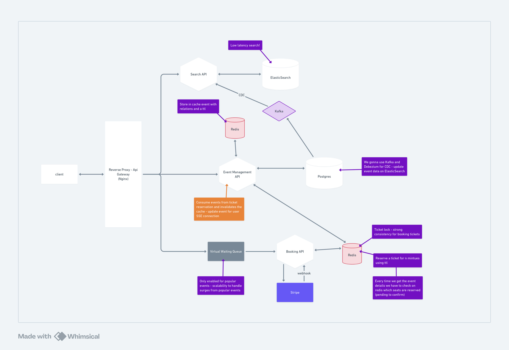

# Ticketmaster

A ticket sales platform built with a microservices architecture in Go, featuring event-driven communication via CDC (Change Data Capture), distributed locking for ticket reservations, and full-text search powered by Elasticsearch.



## Table of Contents

- [Architecture Overview](#architecture-overview)
- [Tech Stack](#tech-stack)
- [Entity Relationship Diagram](#entity-relationship-diagram)
- [Services](#services)
  - [Event Management API](#event-management-api)
  - [Booking API](#booking-api)
  - [Search API](#search-api)
- [Flowcharts](#flowcharts)
  - [Find Event by UUID](#find-event-by-uuid-flow)
  - [Reserve Ticket](#reserve-ticket-flow)
  - [Confirm Ticket](#confirm-ticket-flow)
  - [Search Events](#search-events-flow)
  - [CDC Pipeline](#cdc-pipeline-flow)
- [Running the Project](#running-the-project)
  - [Prerequisites](#prerequisites)
  - [Full Stack (Docker Compose)](#full-stack-docker-compose)
  - [Local Development](#local-development)
- [API Reference](#api-reference)

---

## Architecture Overview

The system is composed of **3 independent Go microservices** that share a single PostgreSQL database and communicate asynchronously via Kafka (CDC):

```
┌─────────┐     ┌──────────────────────┐     ┌─────────────┐
│  Client │────▶│  Event Management    │────▶│  PostgreSQL │
│         │     │  API (:8080)         │◀────│             │
└─────────┘     └──────────┬───────────┘     └──────┬──────┘
     │                     │                        │
     │              ┌──────▼──────┐          ┌──────▼──────┐
     │              │    Redis    │          │  Debezium   │
     │              │  (Cache +   │          │  Connect    │
     │              │   Locks)    │          └──────┬──────┘
     │              └──────▲──────┘                 │
     │                     │                 ┌──────▼──────┐
     │          ┌──────────┴───────────┐     │    Kafka    │
     ├─────────▶│  Booking API (:8081) │     │             │
     │          └──────────────────────┘     └──────┬──────┘
     │                                              │
     │          ┌──────────────────────┐     ┌──────▼───────────┐
     └─────────▶│  Search API (:8082)  │────▶│  Elasticsearch   │
                └──────────────────────┘     └──────────────────┘
```

**Key architectural patterns:**

| Pattern | Description |
|---|---|
| **Cache-Aside** | Redis caches event data (1h TTL) and search results (5min TTL) to reduce DB/ES load |
| **Distributed Lock** | Redis-based locks with 15-minute TTL for temporary ticket reservations |
| **Two-Phase Booking** | Reserve (temporary lock) → Confirm (persist to DB) |
| **CDC (Change Data Capture)** | Debezium captures PostgreSQL WAL changes → publishes to Kafka → Search API consumes and indexes into Elasticsearch |
| **Clean Architecture** | Each service follows: entities → repositories → services → usecases → handlers |

---

## Tech Stack

| Component | Technology | Version |
|---|---|---|
| Language | Go | 1.25 |
| HTTP Framework | Echo | v5 |
| ORM | GORM (with generics) | v1.31 |
| Database | PostgreSQL | 17 |
| Cache / Locks | Redis | 8 |
| Message Broker | Apache Kafka | 4.0 |
| CDC Connector | Debezium | 3.5 |
| Search Engine | Elasticsearch | 9.3 |
| Migrations | Goose | — |
| Hot Reload | Air | — |
| Containers | Docker Compose | — |

---

## Entity Relationship Diagram

```
┌───────────────────────────┐       ┌───────────────────────────────┐
│          venues           │       │          performers           │
├───────────────────────────┤       ├───────────────────────────────┤
│ PK  id         BIGINT     │       │ PK  id          BIGINT        │
│     uuid       TEXT UNIQUE│       │     uuid        TEXT UNIQUE   │
│     created_at TIMESTAMPTZ│       │     created_at  TIMESTAMPTZ   │
│     updated_at TIMESTAMPTZ│       │     updated_at  TIMESTAMPTZ   │
│     location   TEXT       │       │     name        TEXT          │
│     seat_map   JSON       │       │     age         BIGINT        │
└─────────────┬─────────────┘       │     description TEXT NULL     │
              │ 1                    └──────────────┬────────────────┘
              │                                     │
              │                                     │ M
              │                     ┌───────────────┴────────────────┐
              │                     │       event_performers         │
              │                     ├────────────────────────────────┤
              │                     │ PK,FK  event_id     BIGINT     │
              │                     │ PK,FK  performer_id BIGINT     │
              │                     └───────────────┬────────────────┘
              │                                     │ M
              │                                     │
              │ N    ┌──────────────────────────────┤
              └──────┤           events             │
                     ├──────────────────────────────┤
                     │ PK  id          BIGINT       │
                     │     uuid        TEXT UNIQUE  │
                     │     created_at  TIMESTAMPTZ  │
                     │     updated_at  TIMESTAMPTZ  │
                     │ FK  venue_id    BIGINT       │
                     │     date        TIMESTAMPTZ  │
                     │     name        TEXT         │
                     │     description TEXT NULL       │
                     └──────────────┬────────────────┘
                                    │ 1
                                    │
                                    │ N
                     ┌──────────────┴────────────────┐
                     │           tickets              │
                     ├───────────────────────────────┤
                     │ PK  id        BIGINT           │
                     │     uuid      TEXT UNIQUE       │
                     │     created_at TIMESTAMPTZ      │
                     │     updated_at TIMESTAMPTZ      │
                     │ FK  event_id  BIGINT           │
                     │     price     BIGINT           │
                     │     seat      TEXT             │
                     │     status    TEXT             │
                     │              (available|booked) │
                     └────────────────────────────────┘
```

### Relationships

| Relationship | Type | Cascade |
|---|---|---|
| venues → events | One-to-Many | ON UPDATE CASCADE, ON DELETE CASCADE |
| events → tickets | One-to-Many | ON UPDATE CASCADE, ON DELETE CASCADE |
| events ↔ performers | Many-to-Many (via `event_performers`) | ON UPDATE CASCADE, ON DELETE CASCADE |

### Indexes

- `venues`: location
- `performers`: name
- `events`: venue_id, date, name
- `tickets`: event_id, seat, status
- `event_performers`: performer_id

---

## Services

### Event Management API

**Port:** `8080` &nbsp;|&nbsp; **Base path:** `/api/v1/management`

Responsible for querying event details with all related data (venue, performers, tickets). Uses **Redis cache** (1h TTL) for event data and checks ticket reservation status in real-time via Redis locks.

**Endpoint:**

| Method | Path | Description |
|---|---|---|
| `GET` | `/api/v1/management/events/:uuid` | Find event by UUID with full details |

**Response example:**
```json
{
  "uuid": "d0e1f2a3-b4c5-4d5e-8f9a-0b1c2d3e4f5a",
  "name": "The Eras Tour - New York",
  "description": "Taylor Swift brings her iconic Eras Tour...",
  "date": "2026-07-15T20:00:00Z",
  "venue": {
    "uuid": "a1b2c3d4-e5f6-4a5b-8c9d-0e1f2a3b4c5d",
    "location": "Madison Square Garden, New York",
    "seat_map": { "A1": true, "A2": true, "B1": true }
  },
  "performers": [
    {
      "uuid": "e5f6a7b8-c9d0-4e5f-8a9b-0c1d2e3f4a5b",
      "name": "Taylor Swift",
      "age": 34,
      "description": "Multi-award winning pop and country music artist..."
    }
  ],
  "tickets": [
    { "uuid": "c5d6e7f8-...", "price": 35000, "seat": "A1", "status": "available" },
    { "uuid": "d6e7f8a9-...", "price": 35000, "seat": "A2", "status": "reserved" },
    { "uuid": "f8a9b0c1-...", "price": 30000, "seat": "B1", "status": "booked" }
  ]
}
```

> **Note:** The `status` field on tickets reflects real-time state. A ticket can be `available`, `reserved` (temporarily locked in Redis), or `booked` (confirmed in DB).

---

### Booking API

**Port:** `8081` &nbsp;|&nbsp; **Base path:** `/api/v1/booking`

Handles the two-phase ticket purchasing flow. Uses **Redis distributed locks** with a 15-minute TTL for temporary reservations.

**Endpoints:**

| Method | Path | Description |
|---|---|---|
| `POST` | `/api/v1/booking/tickets/reserve` | Reserve a ticket (temporary lock) |
| `POST` | `/api/v1/booking/tickets/confirm` | Confirm purchase (persist to DB) |

**Reserve request:**
```json
{
  "ticket_uuid": "c5d6e7f8-a9b0-4c5d-8e9f-0a1b2c3d4e5f",
  "user_uuid": "550e8400-e29b-41d4-a716-446655440000"
}
```

**Confirm request:**
```json
{
  "ticket_uuid": "c5d6e7f8-a9b0-4c5d-8e9f-0a1b2c3d4e5f",
  "user_uuid": "550e8400-e29b-41d4-a716-446655440000",
  "payment_method_uuid": "660e8400-e29b-41d4-a716-446655440000"
}
```

**Response codes:**

| Status | Meaning |
|---|---|
| `200` | Success (no body) |
| `400` | Invalid request payload |
| `409` | Ticket not available (reserve) or not reserved for user (confirm) |
| `500` | Internal server error |

**Redis key structure:**

| Key Pattern | Purpose | TTL |
|---|---|---|
| `ticket_lock:{ticket_uuid}` | Global lock — prevents other users from reserving | 15 min |
| `ticket_lock_user:{ticket_uuid}:{user_uuid}` | User-specific lock — validates ownership on confirm | 15 min |

---

### Search API

**Port:** `8082` &nbsp;|&nbsp; **Base path:** `/api/v1/search`

Provides full-text search over events using Elasticsearch. Data is synced from PostgreSQL via CDC (Debezium → Kafka). Results are cached in Redis for 5 minutes.

**Endpoint:**

| Method | Path | Description |
|---|---|---|
| `GET` | `/api/v1/search/events?q=&page=&size=` | Search events by text query |

**Query parameters:**

| Param | Type | Default | Description |
|---|---|---|---|
| `q` | string | — | Search query (matches name, description, location) |
| `page` | int | 1 | Page number |
| `size` | int | 10 | Results per page (max 100) |

**Response example:**
```json
{
  "events": [
    {
      "uuid": "d0e1f2a3-b4c5-4d5e-8f9a-0b1c2d3e4f5a",
      "name": "The Eras Tour - New York",
      "description": "Taylor Swift brings her iconic Eras Tour...",
      "date": "2026-07-15T20:00:00Z",
      "location": "Madison Square Garden, New York"
    }
  ],
  "total": 1,
  "page": 1,
  "size": 10
}
```

**Search behavior:**
- Fuzzy matching (`fuzziness: AUTO`) across `name` (4x boost), `location` (2x boost), and `description`
- Only returns **future events** (`date >= now`)
- Sorted by relevance score (desc), then date (asc)

**CDC Consumer — Kafka topics:**

| Topic | Trigger | Action |
|---|---|---|
| `pg.public.events` | Event created/updated | Upsert document in Elasticsearch `events` index |
| `pg.public.events` | Event deleted | Delete document from Elasticsearch index |
| `pg.public.venues` | Venue updated | Update `location` field on all related event documents |

---

## Flowcharts

### Find Event by UUID Flow

```
                    GET /events/:uuid
                          │
                          ▼
                ┌─────────────────┐
                │  Check Redis    │
                │  cache for UUID │
                └────────┬────────┘
                         │
                   ┌─────┴─────┐
                   │ Cache hit? │
                   └─────┬─────┘
                    Yes  │  No
              ┌──────────┴──────────┐
              ▼                     ▼
     ┌────────────┐      ┌──────────────────┐
     │ Use cached │      │ Query PostgreSQL  │
     │   event    │      │ (with preloads:   │
     └─────┬──────┘      │ venue, performers,│
           │             │ tickets)          │
           │             └────────┬──────────┘
           │                      │
           │                      ▼
           │             ┌────────────────┐
           │             │ Store in Redis │
           │             │  cache (1h)    │
           │             └────────┬───────┘
           │                      │
           └──────────┬───────────┘
                      ▼
           ┌──────────────────────┐
           │ Check Redis for each │
           │ ticket lock key      │
           │ (ticket_lock:{uuid}) │
           └──────────┬───────────┘
                      ▼
           ┌──────────────────────┐
           │ Mark locked tickets  │
           │ as "reserved"        │
           └──────────┬───────────┘
                      ▼
               Return EventDTO
```

### Reserve Ticket Flow

```
          POST /tickets/reserve
          { ticket_uuid, user_uuid }
                    │
                    ▼
          ┌───────────────────┐
          │ Check ticket       │
          │ status in DB       │
          │ (status=available?)│
          └─────────┬─────────┘
                    │
              ┌─────┴─────┐
              │ Available? │
              └─────┬─────┘
           No  │         │  Yes
               ▼         ▼
          ┌─────────┐  ┌──────────────────────┐
          │ 409     │  │ Redis Pipeline:       │
          │ Conflict│  │ SETNX ticket_lock:    │
          └─────────┘  │   {uuid} (TTL 15min)  │
                       │ SETNX ticket_lock_    │
                       │   user:{uuid}:{user}  │
                       │   (TTL 15min)          │
                       └──────────┬─────────────┘
                                  │
                            ┌─────┴─────┐
                            │ Lock set? │
                            └─────┬─────┘
                         No  │         │  Yes
                             ▼         ▼
                        ┌─────────┐  ┌─────────┐
                        │ 409     │  │ 200 OK  │
                        │ Conflict│  │         │
                        └─────────┘  └─────────┘
```

### Confirm Ticket Flow

```
        POST /tickets/confirm
        { ticket_uuid, user_uuid,
          payment_method_uuid }
                    │
                    ▼
          ┌──────────────────────┐
          │ Check Redis for      │
          │ ticket_lock_user:    │
          │ {ticket}:{user}      │
          └──────────┬───────────┘
                     │
               ┌─────┴─────┐
               │ Reserved   │
               │ by user?   │
               └─────┬─────┘
            No  │         │  Yes
                ▼         ▼
           ┌─────────┐  ┌──────────────────┐
           │ 409     │  │ TODO: Process    │
           │ Conflict│  │ payment via      │
           └─────────┘  │ Stripe           │
                        └────────┬─────────┘
                                 ▼
                        ┌──────────────────┐
                        │ Update ticket    │
                        │ status → "booked"│
                        │ in PostgreSQL    │
                        └────────┬─────────┘
                                 ▼
                            ┌─────────┐
                            │ 200 OK  │
                            └─────────┘
```

### Search Events Flow

```
      GET /search/events?q=taylor&page=1&size=10
                    │
                    ▼
          ┌───────────────────┐
          │ Build cache key:  │
          │ search:taylor:1:10│
          └─────────┬─────────┘
                    ▼
          ┌───────────────────┐
          │ Check Redis cache │
          └─────────┬─────────┘
                    │
              ┌─────┴─────┐
              │ Cache hit? │
              └─────┬─────┘
               Yes  │  No
          ┌─────────┴─────────┐
          ▼                   ▼
   ┌──────────┐     ┌────────────────────┐
   │  Return  │     │ Query Elasticsearch│
   │  cached  │     │ - multi_match on   │
   └──────────┘     │   name^4, location │
                    │   ^2, description  │
                    │ - filter: date≥now │
                    │ - fuzziness: AUTO  │
                    └────────┬───────────┘
                             ▼
                    ┌────────────────────┐
                    │ Cache result in    │
                    │ Redis (5min TTL)   │
                    └────────┬───────────┘
                             ▼
                      Return results
```

### CDC Pipeline Flow

```
  ┌──────────────┐    WAL     ┌──────────────┐   Kafka    ┌────────────┐
  │  PostgreSQL  │───────────▶│   Debezium   │──────────▶│   Kafka    │
  │              │  (logical  │   Connect    │  topics:   │            │
  │ tables:      │ replicat.) │              │ pg.public. │ pg.public. │
  │ - events     │            │ Monitors:    │ events     │ events     │
  │ - venues     │            │ - events     │ pg.public. │ pg.public. │
  │              │            │ - venues     │ venues     │ venues     │
  └──────────────┘            └──────────────┘            └──────┬─────┘
                                                                 │
                                                                 ▼
                                                        ┌────────────────┐
                                                        │  Search API    │
                                                        │  CDC Consumer  │
                                                        └────────┬───────┘
                                                                 │
                              ┌───────────────────────────┬──────┴────────┐
                              ▼                           ▼               ▼
                    ┌──────────────────┐       ┌───────────────┐  ┌──────────────┐
                    │ op=c or op=u     │       │ op=d          │  │ venue op=u   │
                    │ (create/update)  │       │ (delete)      │  │              │
                    │                  │       │               │  │              │
                    │ Upsert event doc │       │ Delete event  │  │ Update all   │
                    │ in Elasticsearch │       │ from ES index │  │ events with  │
                    │ (fetch venue for │       │               │  │ venue_id →   │
                    │  location)       │       │               │  │ new location │
                    └──────────────────┘       └───────────────┘  └──────────────┘
```

---

## Running the Project

### Prerequisites

- [Docker](https://docs.docker.com/get-docker/) and Docker Compose
- [Go 1.25+](https://golang.org/dl/) (for local development)
- [Goose](https://github.com/pressly/goose) (database migrations)
- [Air](https://github.com/air-verse/air) (hot reload, optional for local dev)

### Full Stack (Docker Compose)

This is the easiest way to run the entire platform:

```bash
# 1. Start all containers (infra + APIs)
make up

# 2. Wait for services, then run migrations + create Debezium connector + seed data
make setup
```

**Services will be available at:**

| Service | URL |
|---|---|
| Event Management API | http://localhost:8080 |
| Booking API | http://localhost:8081 |
| Search API | http://localhost:8082 |
| Elasticsearch | http://localhost:9200 |
| Kibana | http://localhost:5601 |
| Kafka Connect | http://localhost:8083 |
| PostgreSQL | localhost:5432 |
| Redis | localhost:6379 |

**Useful commands:**

```bash
# Check migration status
make migrate-status

# Check Debezium connector status
make connector-status

# Stop all containers
make down

# Stop and remove all data (volumes)
make reset

# Full teardown (delete connector + rollback migrations)
make teardown
```

### Local Development

For developing a single service with hot reload:

```bash
# 1. Start only infrastructure containers
make up-components

# 2. Run migrations and setup CDC
make setup

# 3. Navigate to the desired service and start with hot reload
cd event-management && make run-dev   # starts on :8080
cd booking && make run-dev            # starts on :8080 (use different port or docker)
cd search && make run-dev             # starts on :8080
```

> **Note:** When running services locally, you need to set environment variables or create a `.env` file matching the variables from `docker-compose.yml` (e.g., `POSTGRES_HOST=localhost`).

**Environment variables required by each service:**

<details>
<summary><b>Event Management & Booking</b></summary>

```env
POSTGRES_HOST=localhost
POSTGRES_PORT=5432
POSTGRES_USER=main
POSTGRES_PASSWORD=password
POSTGRES_DBNAME=event-management
POSTGRES_SSLMODE=disable
POSTGRES_TIMEZONE=UTC
POSTGRES_MAX_OPEN_CONNS=25
POSTGRES_CONN_MAX_LIFETIME=300
POSTGRES_MAX_IDLE_CONNS=10
POSTGRES_CONN_MAX_IDLE_TIME=60
SERVER_MODE=development
SERVER_ADDR=:8080
SERVER_READ_TIMEOUT=10
SERVER_WRITE_TIMEOUT=10
SERVER_MAX_HEADER_BYTES=1048576
SERVER_CTX_TIMEOUT=30
REDIS_ADDR=localhost:6379
REDIS_PASSWORD=
REDIS_DB=0
```
</details>

<details>
<summary><b>Search (additional variables)</b></summary>

```env
# All PostgreSQL, Server, and Redis vars from above, plus:
KAFKA_LISTENERS=localhost:9092
ELASTICSEARCH_ADDR=http://localhost:9200
```
</details>

---

## API Reference

### Event Management

```
GET /api/v1/management/events/:uuid
```
Returns full event details including venue, performers, and tickets with real-time reservation status.

| Status | Response |
|---|---|
| 200 | `EventDTO` |
| 404 | `{ "error": "...", "message": "Event not found" }` |
| 500 | `{ "error": "...", "message": "Internal server error" }` |

---

### Booking

```
POST /api/v1/booking/tickets/reserve
Content-Type: application/json

{ "ticket_uuid": "string", "user_uuid": "string" }
```

| Status | Response |
|---|---|
| 200 | No content |
| 400 | `{ "error": "...", "message": "Invalid request payload" }` |
| 409 | `{ "error": "...", "message": "Ticket is not available for reservation" }` |
| 500 | `{ "error": "...", "message": "Internal server error" }` |

```
POST /api/v1/booking/tickets/confirm
Content-Type: application/json

{ "ticket_uuid": "string", "user_uuid": "string", "payment_method_uuid": "string" }
```

| Status | Response |
|---|---|
| 200 | No content |
| 400 | `{ "error": "...", "message": "Invalid request payload" }` |
| 409 | `{ "error": "...", "message": "Ticket is not reserved for this user" }` |
| 500 | `{ "error": "...", "message": "Internal server error" }` |

---

### Search

```
GET /api/v1/search/events?q={query}&page={page}&size={size}
```

| Param | Type | Default | Constraint |
|---|---|---|---|
| q | string | — | Search text |
| page | int | 1 | ≥ 1 |
| size | int | 10 | 1–100 |

| Status | Response |
|---|---|
| 200 | `SearchEventsResponseDTO` |
| 500 | `{ "error": "...", "message": "Internal server error" }` |

---

## Project Structure

```
ticketmaster/
├── docker-compose.yml          # Full infrastructure + services
├── connector-config.json       # Debezium PostgreSQL CDC connector config
├── Makefile                    # Orchestration: migrations, CDC setup, Docker
├── @docs/                      # Architecture diagrams
│
├── event-management/           # Event query service
│   ├── cmd/server/main.go
│   ├── internal/
│   │   ├── entities/           # Domain models (Event, Venue, Performer, Ticket)
│   │   ├── repositories/       # Data access layer (GORM)
│   │   ├── services/           # Event cache (Redis), Ticket lock check (Redis)
│   │   ├── usecases/           # FindEventByUUID
│   │   ├── handlers/           # HTTP handlers + DTOs
│   │   └── server/             # Config, DB, Redis, Echo setup
│   └── migrations/             # Goose SQL migrations + seeds
│
├── booking/                    # Ticket reservation & confirmation service
│   ├── cmd/server/main.go
│   ├── internal/
│   │   ├── entities/           # Domain models
│   │   ├── repositories/       # Ticket repository (availability check, status update)
│   │   ├── services/           # Ticket lock (Redis distributed lock)
│   │   ├── usecases/           # ReserveTicket, ConfirmTicket
│   │   ├── handlers/           # HTTP handlers + DTOs
│   │   └── server/             # Config, DB, Redis, Echo setup
│
└── search/                     # Full-text search service
    ├── cmd/server/main.go
    ├── internal/
    │   ├── brokers/cdc/        # Kafka CDC consumer (Debezium events + venues)
    │   ├── entities/           # Domain models
    │   ├── repositories/       # Venue repository (for location enrichment)
    │   ├── services/           # Elasticsearch engine, Search cache (Redis)
    │   ├── usecases/           # SearchEvents
    │   ├── handlers/           # HTTP handlers + DTOs
    │   └── server/             # Config, DB, Redis, ES, Echo setup
```
